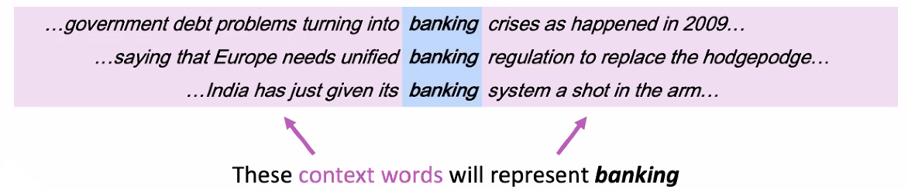
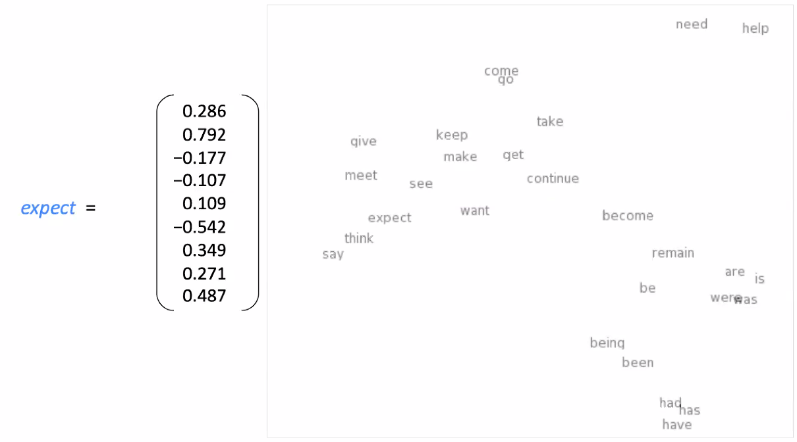
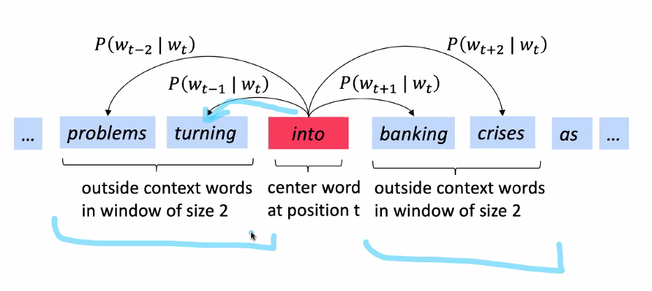

# Word Representation

* _The dog CHASES the cat_ and _The dog FOLLOWS the cat_ should be somehow similar to the computer.
* Same with Google: _I want to buy a dog/puppy_.

How do we represent the meaning of a word?
* Can use the meaning of the dictionary. Useful for humans, not for computers.
* Common solution: WordNet, a thesaurus, collection of words, containing lists of synonyms sets and hypernyms ("is a" relationships).

Problems with WordNet:
* Not all synonyms are complete synonyms: _proficient_ and _good_. Only on some contexts.
* Missing new meanings of words: _genius_, _badasss_, etc.
* Impossible to keep up-to-date. Not automatic.
* No way to say that _chair_ and _table_ are somehow similar.

Representing as discrete symbols:
* [0 0 0 0 0 0 0 1 0 0 0]
* One-hot vectors: just one 1, the rest 0s.
* Vector dimension = #words in vocabulary (e.g. .5M).
* No notion of similarity. So _motel_ and _hotel_ are similar but have really different representation.
* Can try to use WordNet, but all the drawbacks still remain.
* Instead: learn to encode similarity in the vectors themselves.
* E.g. first dimension is noun 0/1, etc.

Representing words by their context:
* "You should know a word by the company it keeps". 
* Successful in NLP.
* Context is though as a fixed-size window around the word.

Word vectors:
* Dense vector for each word; similar words have similar contexts.
* Notation: word embeddings or word representations.

Word meaning as a neural word vector. Visualization.

Word2vec:
* P(t | c) or P(t | c): probability of the context given the word which we see in the context.
* Likelihood is a function to be optimized.
* Uses softmax.

Train the model:
* Theta represents all model parameteres, in one long vector. All the centered words and context words.
* Calculating all gradients.
* Uses two vectors. 
* Two models: skip-grams (SG, independent of position), continuous bag of words (CBOW).
* Can add negative sampling.

Optimization:
* We get an objective function _J_(_θ_), and minimize it.
* There is a learning rate (conveys a learning step).

Stochastic Gradient Descent:
* It is slow to calculate everything.
* So just take a small subset of your data (window), and then apply to everything.
* The good thing is that Stochastic Gradient Descent escapes better from local minimum.
