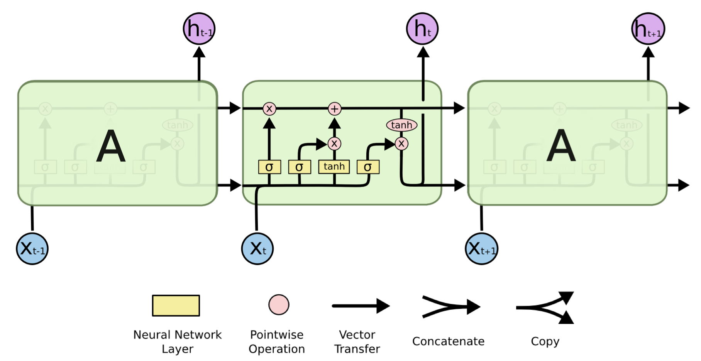
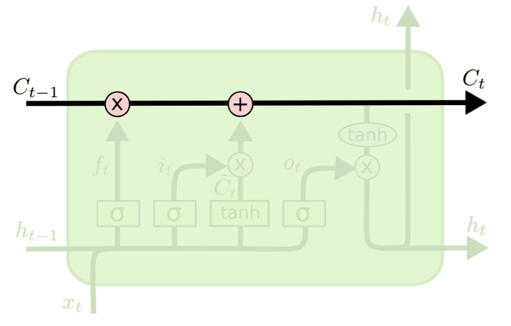
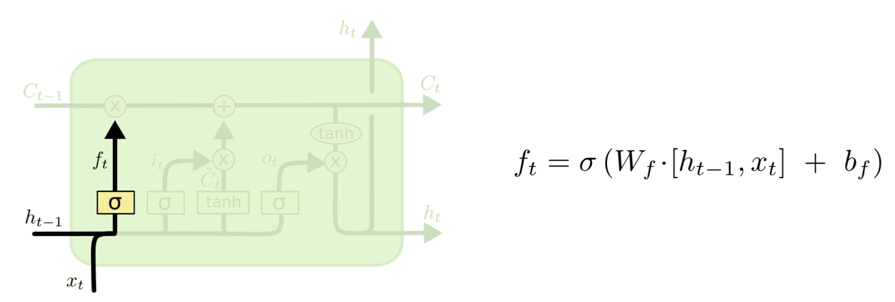
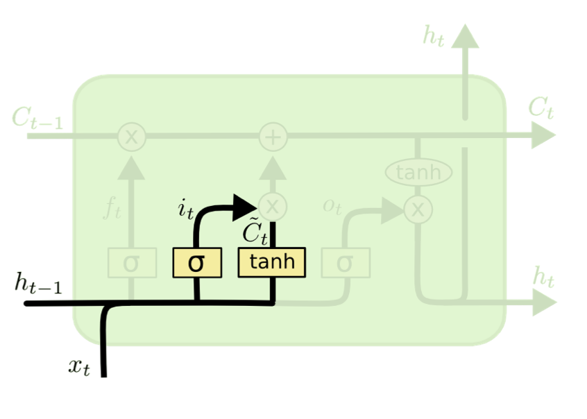
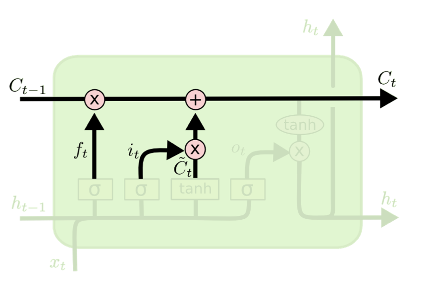
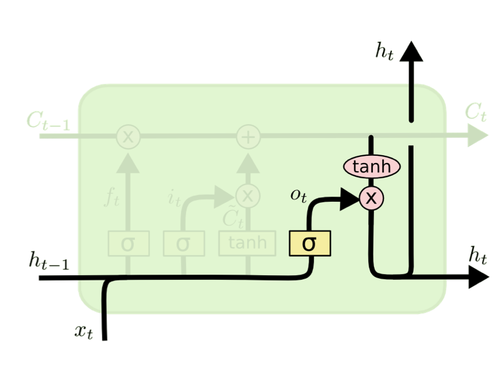
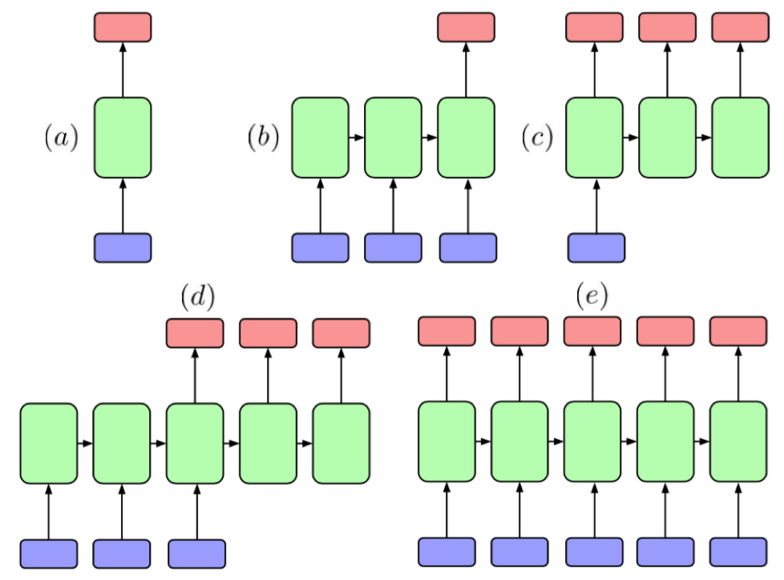

# Long short term memory

Why?:
* Time is a variable.
* Linear (left to right).
* Concept of a sequence.

Use cases:
* Predict the next word in a sentence.
* Predict the next frame in a video.
* Easier if you know what happened earlier in the sequence.

Markov models:
* Traditional Markov models are limited because their states must be drawn from a discrete state space.
* Problems with langauges like German, where there is too much distance between verb and subject to predict a word.

Neural network:
* input -> hidden -> output.

Neural network, extended:
* (input + prev_input) -> hidden -> output.

Recurrent neural network:
* (input + prev_hidden) -> hidden -> output. Better because hidden encodes a "state" throughout the same sequence.
* This is the learning phase.

LSTM:
* Fixes long-term dependencies.
* Vanishing/exploding gradients: problem of underflows.

We don't want to remember everything:
* Only the important things.
* The hidden layer has a limited number of nodes.
* Information of the first hidden layer is reduced to 50%, 25%, 12.5%... So reduces to 2^-N.
* Information is gated: not allowing multiplication.

Vanishing/exploding gradient:
* Exploding gradient: multiplying by 5 or 6, it explodes.

History:
* Hopfield, 1982, rebuild patterns.
* Jordan, 1986. 
* Williams & Zipser, truncated backpropagation through time. Do backpropagation with just a couple of steps.
* Elman, 1990. Instead of taking things from the output, take from the hidden layers.
* Gers, Schmidhuber. Add the "Forget" gate.

Idea:
* Do not multiply.
* Gate all the operations so you don't cram everything.

LSTM:

Cell state:

Forget layer:

* Using multiplication to forget.

Input Gate Layer:

Cell state update:

* It is added a weighted value.

Output value:

* We have to return something.

Bidirectional LSTM networks: 
* Connects last words in a sentence with the first ones.
* Not useful for online applications.

Architectures:
* N inputs - M outputs. 
* Can decide.

